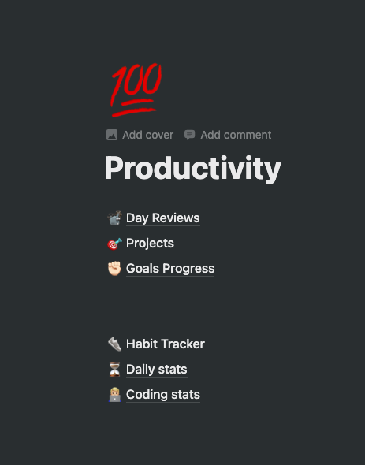
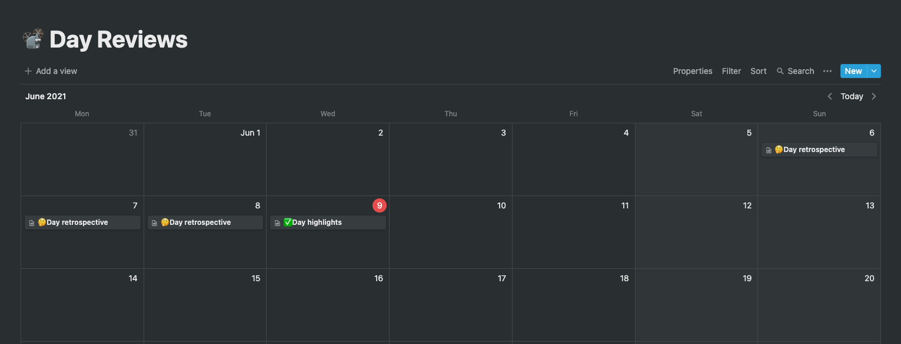
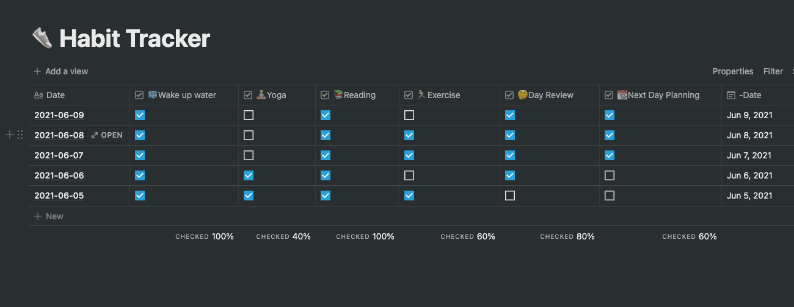
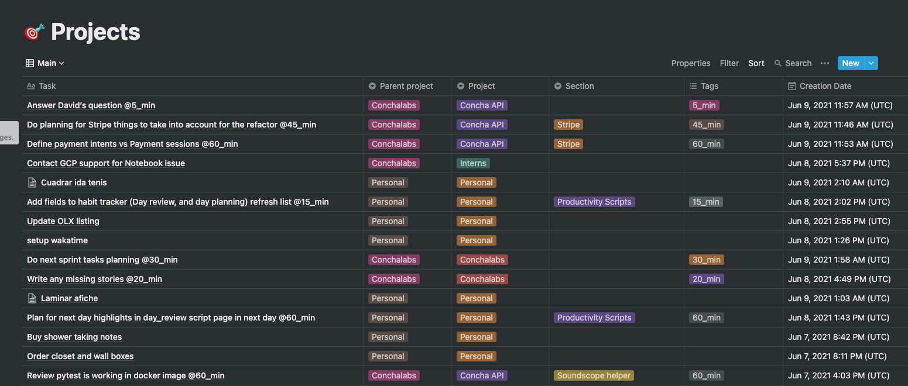
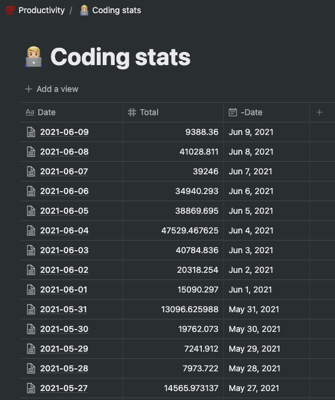
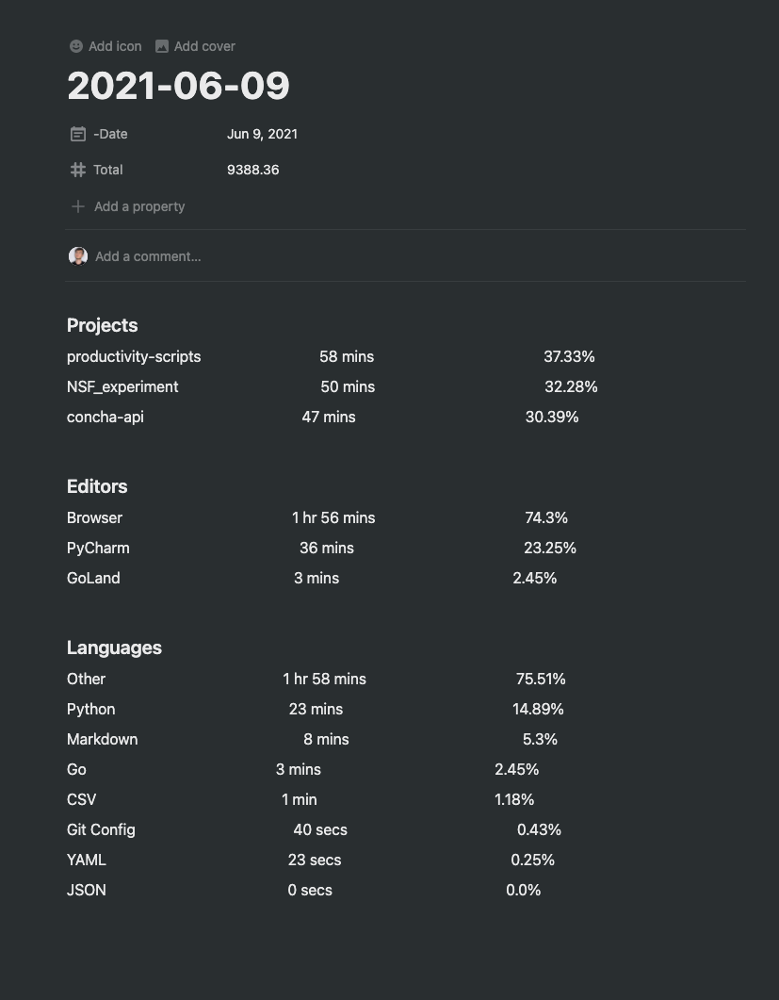
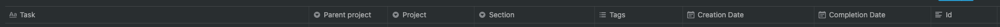
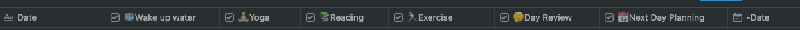
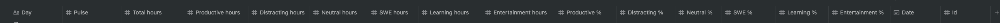

# Productivity apps wrapper

This project aims to be a wrapper for some common productivity apps that I use in my everyday basis. This project is the result of my
interest on doing this, and the poor integrations made by [zapier.com](http://zapier.com/) and [automate.io](http://automate.io/).

It aims to help you do understand what you get done every day, keep track of it, get valuable statistics out of your daily performance, and
performing even better on your next day.

### Apps wrapped

- [Todoist](http://todoist.com/) for tasks management
    - Habits project independently
    - Goals project independently
- [RescueTime](http://rescuetime.com/) for passive time tracking
- [Wakatime](http://wakatime.com/) (IDE's plugin for programming time tracking)


- [Notion](https://www.notion.so/) as the place where the data of the previous 3 resides.

### Tools used

- [Todoist API](https://developer.todoist.com/sync/v8/)
- [RescueTime API](https://www.rescuetime.com/apidoc) (Special thanks to the [@rescue_time]() team, who helped me with API fixes for this)
- [WakaTime API](https://wakatime.com/developers)
- Notion new Beta [official API](https://developers.notion.com/)
- Notion [Unofficial python API](https://github.com/jamalex/notion-py) (without this I also could've not achieved this project)
- [Heroku](https://dashboard.heroku.com/) for deploying the app as is the simplest and quickest I found

## Screenshots

Image             |  Explanation
-------------------------|-------------------------
 | This is the main page wrapping the following next pages shown here below







Database             |  Details
-------------------------|-------------------------
 | 

## Setting up your own instance

### Todoist setup

### Notion setup

- Generate the notion token for the integration
- Get the Token v2 for the unofficial API as explained [here]()


#### You need to create a few pages:
Duplicate everything as a [Template](https://www.notion.so/josancamon19/Copy-of-Productivity-2a42742502fe410c8e875a870cf015a9)
#### Explanation
1. **Day reviews** pages (as a calendar)
2. **Projects** table with the next columns
   
    - ```Task``` as the title
    - ```Parent project``` as select
    - ```Project``` as select
    - ```Section``` as select
    - ```Tags``` as multi select
    - ```Creation Date``` as Date
    - ```Completion Date``` as Date
    - ```Id``` as text
3. **Goals Progress** Page:
   
    - ```Task``` as the title
    - ```Goal``` as select (A todoist section)
    - ```Date Completion``` as Date
    - ```Id``` as number
4. **Habits** Page
   
    - ```Date``` for the title
    - ```-``` Next columns for each habit
    - ```-Date``` for setting a Date object
5. **Daily stats** Page
   
    - ```Day``` for the title
    - ```Pulse``` Number column
    - ```Total hours``` Number column
    - ```Productive hours``` Number column
    - ```Distracting hours``` Number column
    - ```Neutral hours``` Number column
    - ```SWE hours``` Number column
    - ```Learning hours``` Number column
    - ```Entertainment hours``` Number column
    - ```Productivity %``` Number column (% formatted)
    - ```Distracting %``` Number column (% formatted)
    - ```Neutral %``` Number column (% formatted)
    - ```SWE %``` Number column (% formatted)
    - ```Learning %``` Number column (% formatted)
    - ```Entertainment %``` Number column (% formatted)
    - ```-Date``` for setting a Date object
    - ```Id``` as number
6. **Coding stats** Page
   
    - ```Date``` for the title
    - ```Total``` Seconds with total hours
    - ```-Date``` for setting a Date object
### Code setup

### Deployment setup

## TODOs

- Integrate Apple Health data (Sleep too)
- Integrate with apple fit data
- Page details as tables instead of ```\t``` separated strings

## FAQ

## License